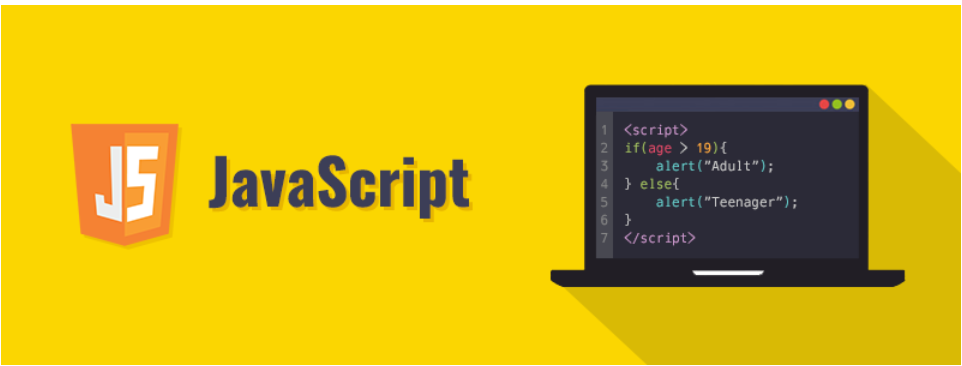

## Why JavaScript is a freak programming language?

JavaScript for me is a new programming language.  I have learned many different languages such as C, C++, Java, and python before taking this class (software engineering), but I have never heard about the JavaScript before this class.  After I started learning this new language, I would say JavaScript is a freak. Although the other programming languages such as C++ and Java are different, they are very similar in many ways.  However, JavaScript is huge different from the other programming languages such as C, C++ and Java I have learned before.  

## What are the differences?

The first difference that JavaScript impressed me was the type declaration.  In the other programming languages such as C and Java, when I want to create a new variable, I need to declare the type of that variable first.  For example, if I want to create an integer x, I need to write “int x;” where “int” means the type “integer.”  There are also a lot of different types such as integer, double, character available in those programing languages such as C or C++. However, in JavaScript, different from C and Java, I don’t need to declare the type of the variable when I want to create a variable; instead, there are only three different declaration keywords in JavaScript, and they are “let”, “var”, and “const.”  

Keywords “let” and “var” are very similar.  After I initialize a variable declared by one of these two keywords, I can reassign a different value to that variable.  The only difference between keyword “let” and “var” is the scope of the use.  The variable declared by keyword “var” can be used in the entire function, but the variable declared by keyword “let” can be only used in the same block or loop. The keyword “const” is very different from those two keywords “let” and “var,” and I cannot reassign value to the variable declared by the keyword “const.”  Although these three keywords may be used in different situation, these three different keywords can be used to declare any type of variable. For example, if I want to create an integer or string variable, I can use any of these three keywords above.  

The second difference that JavaScript impressed me was the function declaration.  In the other programming languages such as C and Java, when I want to make a function, I need to declare the return type of the function.  For example, if I want to make a function called “func” that would return an integer 0 in C, I need to write “int func(){return 0;}” where the “int” means the return type integer.  However, if I make some functions using JavaScript, I need to write “function func(){return 0;}.”  In JavaScript, I don’t need to write the return type of the function; instead, I just need to use the keyword “function” to declare a function.     

## Conclusion

Although JavaScript is very different from the other programming language, I think it is a good language for software engineers. The software engineers or developers may need to create a lot of different type of variables when developing a program.  If they use the other programming languages such as C and Java, they may make some mistakes such as a typo when they declare the type of the different variables; therefore, they may get the type mismatch error.  It would be very hard to solve the problem since the program may contain hundreds of thousands of lines of codes.  In addition, the weakly typed declaration may be flexible and convenience for the programmers if they want to use the same variable in different type. 
