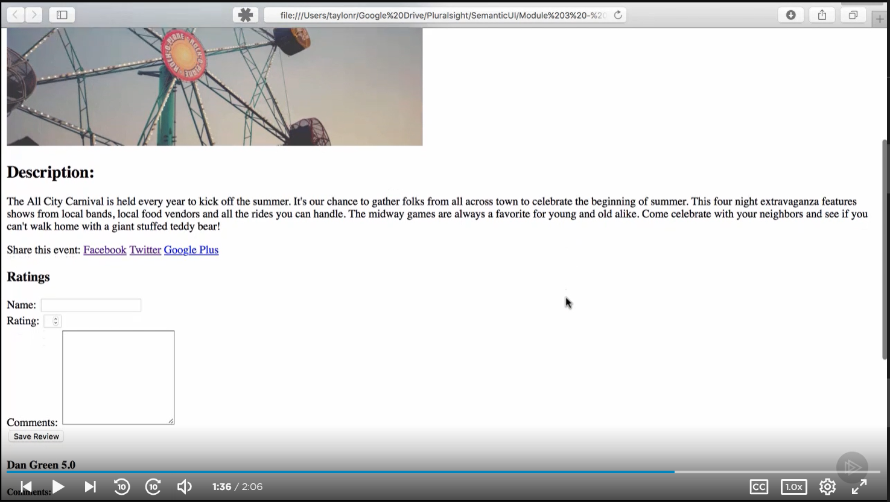
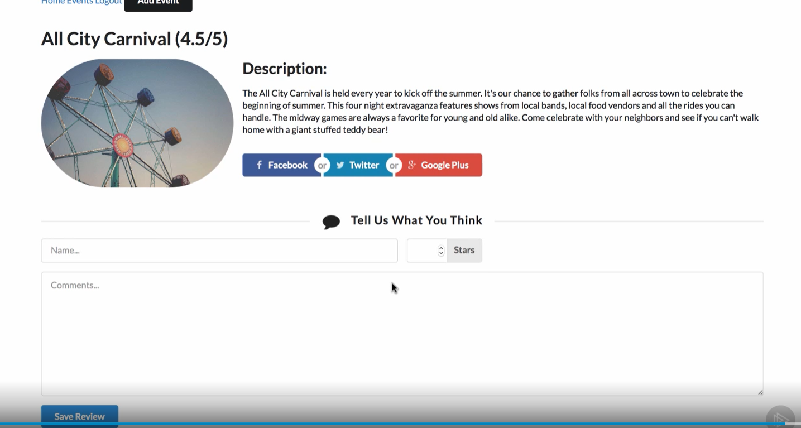

I have been impressed by some websites design and user interface.  These website user interface make the webpage attractive and beautiful.  Whenever I view these amazing webpages, I wonder how people make them.  I have been dreaming I will make some attractive webpages one day in the future. 
## Why is UI the life of a webpage?

Last week, we finally moved in to one of my favorite topics, which is the webpage design.  However, I really didn’t like the page I just made with the HTML and CSS.  I felt the webpages I made last week was boring, and they are very different from the webpages I viewed in the internet before.  
This week, after I started looking at the UI design, I finally understand why my webpages I made last week were so bad.  I think UI is the life of a webpage.  A good UI can make the webpage more interesting.  A good UI can interact with people.  A good UI also can make people understand more about the webpage.  A webpage without a UI is death. 
Here is the example to show how a UI can change a webpage.

This is the website without using a UI.  We can see there is only one big picture on the left, and there is nothing on the right site.  Also, the description text takes up the entire screen, and the white space is inconsistent.  The hyperlinks for the Facebook, twitter, and google are just uninteresting text, and people may not know they are hyper link.  The fields for the name and comment are also too small, and people may have hard time to type in their information. 

After adding a UI to the webpage, everything becomes better.  The picture is no longer stay alone, and the description text is next to the picture.  People don’t need to scroll up to look at the picture while they are reading the text.  The Hyperlink for Facebook, twitter, and google now become a group of interesting colorful buttons.  There are also some icons in the button.   People would prefer to view picture instead of reading text, so more picture would make the website more attractive.  In addition, the website now contains larger areas for people to enter their name and comments, so people don’t need to just focus on a small tiny area when entering their data.  Hence, UI is very important of a webpage.

## Why do we use sematic UI?

Although a UI can make a webpage better, it is not easy to design and make a UI just with CSS.  To make a good UI, if we just use CSS, it would be a nightmare.  We may need to import a lot of pictures and figure out how to locate the different pictures and text to make a nice UI.  We need to try different size and try different location.  A sematic UI may help us solve that problem.  Sematic UI contain a lot of build in classes and components.  It also contains a lot of different icon that we can use for a webpage. For example, if we want to import a Facebook icon, we just need to type “class = “facebook icon”.”  We don’t need to import any pictures for the icons and resize them to a good size.

In addition, sematic UI use nature language, so we don’t have to memorize any syntax.  If we want to import something from the sematic UI, we just use the normal English phrase without any weird special characters.  That makes designing and building a website with a good UI easier.

## Conclusion

A UI is the life of a webpage. A good UI can make a webpage alive and attract more people.  To make a good UI, we need to use some UI framework tool such as Sematic UI. I am looking forward to building a beautiful attractive webpage with sematic UI.
