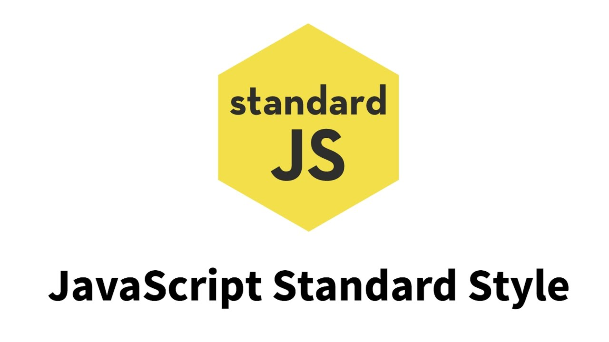

Many people think coding standard is unnecessary, and I had the same feeling when I started to program with the coding standard.  I felt the coding standard was very annoying.  Even if I didn’t have any syntax problem, the IntelliJ still showed me a lot of errors due to the coding standard.  I don’t really like the coding standard, but I can see why the coding standard is important for software engineering. 

## Why is Coding Standard annoying?

Before I started to program with the ESlint which is a tool to check the coding standard, I thought the ESlint was just a tool that can check my coding syntax.  However, it also checks my code format such as the index and space.  If I don’t have a space after a comma, the ESLint gives me an error.  If I don’t put the open curly bracket on the same line as the if statement, the ESLint gives me another error.  It even doesn’t want me to put double code for a string.  As I wrote more JavaScript codes, I would see more and more red waved lines at the bottom of my codes.  The red waved line would distract me from coding, and I don’t know whether I fix the errors first or keep writing the codes without fixing them.  After I finish coding for my project, I usually get more than twenty errors due to the coding standard.  

To fix the errors due to the coding standard, I need to use my mouse to point to each code that causes the error to show what error I have.  It is also not easy to understand some error messages, so it usually takes me a lot of time to fix it to get a green check mark.   

Coding standard is just a Coding style or format, and a coding standard error is not a syntax error.  Coding standard won’t affect if the program can be compiled and run, and I still can compile and run my code smoothly without following the coding standard.  Coding standard just makes me spend more time on coding; therefore, at the beginning, I wondered why we need to follow the coding standard. 

## Why is Coding Standard important?

Although coding standard is annoying, I think it is still very important for the software engineers to follow the coding standard while programing.  After I fixed all the ESLint errors, I found all the codes I wrote were very clear and neat.  I could easily identify each function I wrote, and I could also find out if I missed any curly brackets easily.  In addition, it is easier for me to follow the logic of my program.

Moreover, I think if everyone follows the coding standard while coding, it is easier for other people to read and understand the code.  If the syntax is the grammar for the computer to understand, the coding standard is the grammar for the programmer to understand code.

## Conclusion

Although Coding standard is annoying at the first time, I think I am getting used to it.  At the beginning, I got a lot of ESLint errors after finishing writing the JavaScript codes.  However, I find out as I do more programming with the ESLint and coding standard, I get less and less ESLint errors.  I found out that I automatically follow the coding standard without ESLint.  Therefore, I think if I practice coding with the coding standard more, I will get more familiar with it.  I believe if I practice more, the coding standard won’t slow my programming speed down.  I think coding standard will help me debug the code easier, and I will have less time to debug my code.
