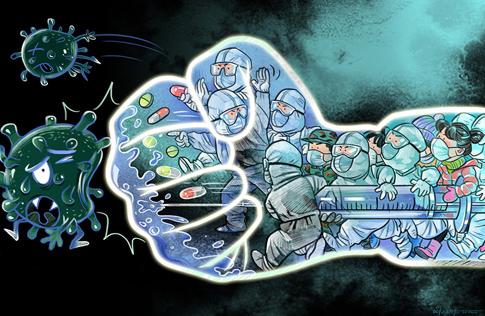

Since I started studying at UH Manoa, I haven’t had any semester as bad as this semester.  The coronavirus has been ruining my daily study, daily life and mood.

## The coronavirus ruins my daily study.

In January, one of my friends at China told me he was told he needed to study at home due to the coronavirus.  At that time, I felt pity about him, but I never thought I would need to do the same thing after two months.  As the virus spread to the whole world, more and more countries and schools take measurement against the virus.  UH announced that all the classes would move to online after spring break.  

When I heard that, I felt happy because I did not need to go to school anymore. However, one week after the online classes, I felt I was wrong.  It is much harder to take the classes online, which are usually happened in school.  Since we don’t go to school, many of my professor would assign more assignment for me to do.  I also lacked the environment to study like I did in the school.  It is hard for me to concentrate to the video or online zoom meeting at home.  Since my professors cannot read our face, they don’t know if we understand the lecture.  They just talk very fast, so it is not easy for me to follow sometime.  

However, I found out one advantage for the online classes.  I found out more and more people are willing to ask question in the online meeting.  I think if we are having class in a classroom, most of the students probably are too shy to ask questions.  However, while in a internet meeting environment, nobody would see each other; therefore, more people would ask questions.

## The coronavirus ruins my daily life.

The Coronavirus not only ruins my daily study but also ruins my daily life.  Since the mayor issued a stay at home order, I must stay at home for most of time.  I have stayed at home since he issued that order.  My parents also could not work dur to that order.  Therefore, we are all at home the whole day.  While I was doing my homework or project or studying, my parents would bother me while they were watching or playing their phones.  In addition, since we have stay home, I cannot go out to talk with my friends for the projects.  We have to a online meeting, so it is hard for us to work together to finish the project.

## The coronavirus ruins my mood.

Whenever a news says how many people test positive for the virus or how many people die from the virus.  I felt scary and sad.  I felt so bad for those people who tested positive or died from the illness, but at the same time, I also felt scary.  The virus has a very high infection rate, and I don’t know if I will get this terrifying virus in the future.  When my parents or I was coughing, I just felt scary.   A lot of people also died due to that virus.  I don’t know if I can survive for that period.  I just can pray and hope the vaccine for that virus would come out as soon as possible. 

## Conclusion

Although the virus is killing a lot of people and affecting the economy for the whole world, I believe we can defeat the virus.  If all people in the world unite, I believe we can have our life back very soon.  Let’s fight against the covid 19.  Hope we don’t need to wait too long for that day. 
