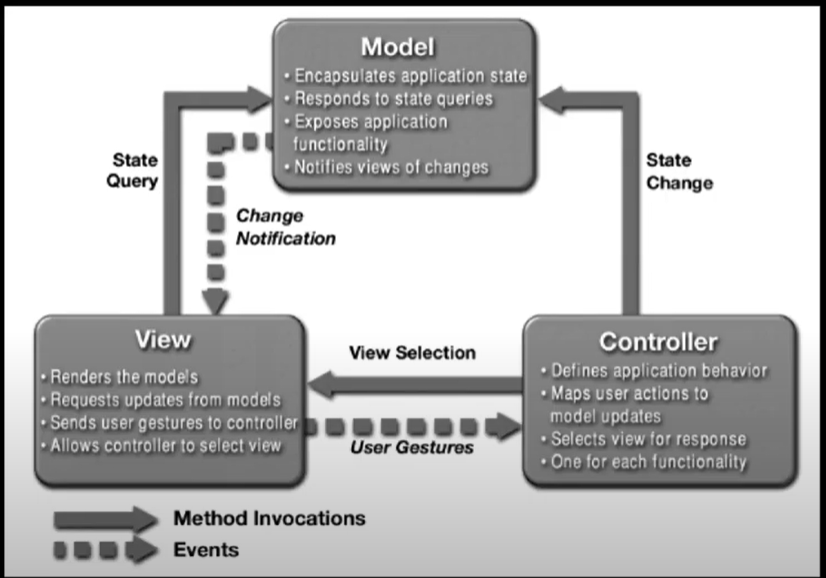

Writing codes is not the only thing the Software engineers need to do.  Software engineers also need to design great application.  However, the software engineers need to design a lot of applications, and they may face the same or similar problems a lot of times.  Therefore, it is the best for the software engineers to have a general, reusable solution to the commonly occurring design problem when they are designing the application. 

Thinking about a general formula in math or physics, when we face some problems that we think we can solve with the general formula, we just use it to solve the problems.  The formula would save us a lot of time since we do not need to think about it from the beginning.  A general solution to the commonly occurring design problem is like a general formula, which we can use it for many different design problems.  This type of the solution is also called design pattern.

There are three types of design patterns. The first one is creational patterns, and it is talking about how to create object or applications.  The second one is called structural patterns, and it is talking about how to represent object.  The third one is called behavior patterns, and it is talking about how to connect all different type of objects.

There are many different design patterns.  The most popular design pattern is prototype design pattern.  We use that when we want to create objects by making a copy of a prototypical instance.  We often use prototype design in the JavaScript.

The observer design pattern is also very useful.  An object uses observers which are its dependents to monitors the state constantly, and once the state changes, the observer would notify the object automatically.  Meteor uses this design pattern.   When we modify the code, Meteor would update the application automatically.  

MVC design pattern is another design pattern which we would use in many web-applications designs.  MVC design pattern contains three parts: Model, View and controller.  Model can be any backend database server.  View would be the front-end user interface such as react and angular.  Controller defines the application behavior, and we often use it in route.  All three parts work together.  View need sends query to the Model to get the data.  If users do something in the view, the view will send the action to the controller.  The controller then would either send the view selection back to the view or state change to backend model depended on the user’s action.

 

The last design pattern I think is useful is the singleton design pattern.  Singleton design pattern allow us to create a global variable or objects which can be used by the other.  We also usually use this design pattern in web design.  When we want to make all the other page use the same class, we need to export the class. 

We can use the design pattern in user interfaces, database, real-time system, and testing.  For the project which is “textbook hunt” we are currently working on now, I think we use prototype, MVC and singleton design pattern. We use prototype in listing textbook page when we want to list all the information about the book.  For the MVC design, we use MongoDB as the backend database Model.  We use the react as the front-end view, and we use the react router as the controller.  Moreover, we also export all different classes so that the other page or classes can use it.  For example, we export the Bookitem class which would list the information about the book as card, and we then use the import and use the Bookitem class in the listing book page.  

Design Patterns are very useful for the software engineers to design and build web applications.  They simplifier the way the engineers use to build the nice web application.  
