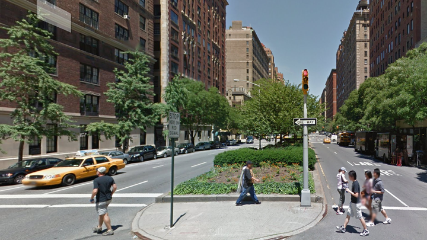

## What is ethic for software engineering?

According to the “ACM Code of Ethics and Professional Conduct,” the ethic for the software engineering is doing the good things when developing software.  The good things include concerning the life of all people and society, avoiding negative consequences that would harm people, being honest and trustworthy, the software we design must be fair to everybody, respecting all other team members, and considering the security issues and the privacy.

## Why do software engineers need to consider the ethic? 

Many software engineers may think ethic has nothing to do with them.  However, as computer technology development, we are relying on the computer technology in my ways.  We need to use computer technologies to do many kinds of jobs.  Computer and software have been everywhere, and they have become a part of our lives.   Since the computer and software have had huge impacts on our lives, they would cause some vulnerabilities.  Some people may use these technologies to do something that are bad for the other people or societies, and they are known as hackers. Some developers may not consider some potential ethical issues when developing the software, so the software they build may also harm some people and cause some very bad consequences. If we don’t follow the ethic, nobody would trust and use our app again.  Hence, ethic has been very important for software engineers.

## Privacy

Among all different ethical issues, I think Privacy is one of the most concerned issues.  As the development of the internet, we now can do almost everything online, such as buying things and paying online.  However, many internet applications require our personal information, and it would increase the likelihood of the leakage of our personal information.  Couples years ago, there was a massive data breaches in Yahoo, which caused a lot of personal data expose to the public.  Equifax also exposed the personal information of 147 million people due to the data breach.  Therefore, data breaches are always happening.  As the software engineers, we should try our best to prevent the personal private data from leaking. 

Google also launched a controversial feature called Street View in the google map in 2007.  This feature allows users to view all the real photographs of the neighborhood, city block, stores and even individual residences.  They went to the locations physically and use a camera to capture and record the real image of each streets and blocks.   This feature can make people view the places they want easily without physically going to the places; however, this also causes some privacy problems.  A lot of people and their assets are exposed due to this feature.  People who were captured by the camera are also being showed in the street View.  Some people may take advantage of this feature to find where the target people they are looking for are.  Some people would take advantage of this feature to do some criminal things such as kidnapping and theft.  Therefore, they should have considered about the privacy when making this app, and they may have covered the people’s face with masks or even just removed the people from the images.  

Due to the coronavirus, Google and Apple are developing am app to track the people who have the coronavirus.  I am concerning if this app would cause another privacy issue.    Although it may be a good app to avoid the spread of the virus, I don’t know if people would discriminate against the people who got the virus once they know them.  I hope they can think about this problem when making the app.

## Conclusion

Ethics are very important for software engineers.  As Software engineers, we should know our apps would have huge impacts on a lot of different people, including good impacts and bad impacts.  Although there is no way to guarantee our apps would be 100% not harmful for anybody, we should mitigate the bad consequences.   
