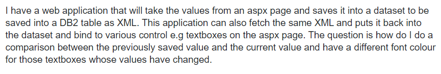

I like asking questions.  I used to think asking more questions was always a good thing, and people like others who like to learn.  Therefore, when I had some questions, I used to ask the other people for help.   However, after I read the article “How to ask questions the smart way” by Eric Raymond, I now think, as a student who want to be a software engineer in the future, I should not ask somebody for help right after I get the questions.  I need to think if it is a good question or smart question first before asking.   Software engineer need to ask smart questions in a smart way.
## What are smart questions?

According to the article “How to ask questions the smart way” by Eric Raymond, a smart question should be a question we cannot solve it by ourselves.  As software engineers, before we ask the question, we are supposed to attempt to solve it by ourselves first.  We can try to figure it out with the knowledge we have so far.  We can try to look for the answer from the the note we have taken before.  We also can use the internet and search engine like google to find the answer.   Somebody might has already asked the same question in the internet, and some articles from the internet may give us the answer.  If we still cannot get the answer after all the attempts, we know that is a good or smart question we should ask.  
I found a person who asked, “What are metaclasses in Python?” when I was viewing the StackOverFlow. Then, I went to the google search engine and typed in the same question in the search box.  After a couple seconds, google shows me a lot of websites that related to the question.  The first one is the “Python Tutorial: Metaclasses Tutorial - Python-Course.eu.”  The Python Tutorial explains what the metaclass is and shows how to use the metaclass in Python.  I can easily get the answer for the question “What are metaclasses in Python?” from the Python Tutorial without asking the question.  Therefore, it is not a good smart question.  If we can solve the question by ourselves, we should not ask that question.  

When we are solving the problem by ourselves without help, we will be impressed by the problem and how to get the solution;  therefore, when we see the same problem again next time, we can get the best solution right away without thinking about it.  This practice can help us become a good and smart software engineer. 

## How to ask questions in a smart way?

Asking smart question is not enough, and as software engineers, we also need to ask smart question in smart way.  
We should ask understandable question.  If the other people don’t understand the question we ask, how can they help us and give us the answer.  Therefore, we need to make sure the other people understand the question we ask, and we need to present the question in a smart way.

To make people understand more about the question, we can try to show them the example like what the output should be given a specify input.  If we are asking a coding problem, we need to post the code and the test run.  Moreover, we also need to make sure we write the complete sentences with the correct grammar.  We should try our best to simplify the question and sentences.  We should describe the problem clearly.   Many people don’t want to read complicated sentences.  Asking a question is not writing an essay, and what we need to do is to make sure the other people can understand our problem so that they can give us a good solution.

In addition, we need to ask informative question. If our questions don’t have enough information, the other people may give us the wrong solution.  We need to try our best to give the other people more information about the question.  According to the article “How to ask questions the smart way” by Eric Raymond, we should “be precise and informative about the problem.”  We should also try to give all information for all the objects related to the problem because that would make the other people give us more accurate solution that work on our program.  For example, if we ask how to configure a network on a switch, the answerer may give us the wrong solution that would not work on our switch because different switch with different ISO have different configuration rule.  The other people may just give us the solution that only works on certain switch.  However, if we asked, “how to configure a network on a cisco 2960 switch with the specify ISO,” the answerer would give us the right solution that work on our switch.   

Besides that, we also need to tell the answerer what our requirement is.  For example, if we ask, “how to write code to sort a number list,” the other people may give us the solution we don’t want.  There are many different algorithms that solve this problem, so we should specify the requirement we want such as run time speed.  

A person asked the below question in stackOverflow:

I think it is not a good smart question.  What kind of the database does the person use?  What programming language does the person use in the application?  There are a lot of database system and programming language, and different database system or different programming language may lead to a different solution.  Besides that, it is hard for me to understand the question.  What is the previously saved value?  Is the previously saved value from the database?  What is the current value?  The person should explain more about the saved value and current value more clearly.  Also, it would be much better if he could provide an example. 

## Conclusion

As software engineers, we should try our best to solve the problem first so that we know how we can approach the solution.  When asking questions, we need to ask informative and understandable questions; therefore, other people know how to help us and give us the right solution.
