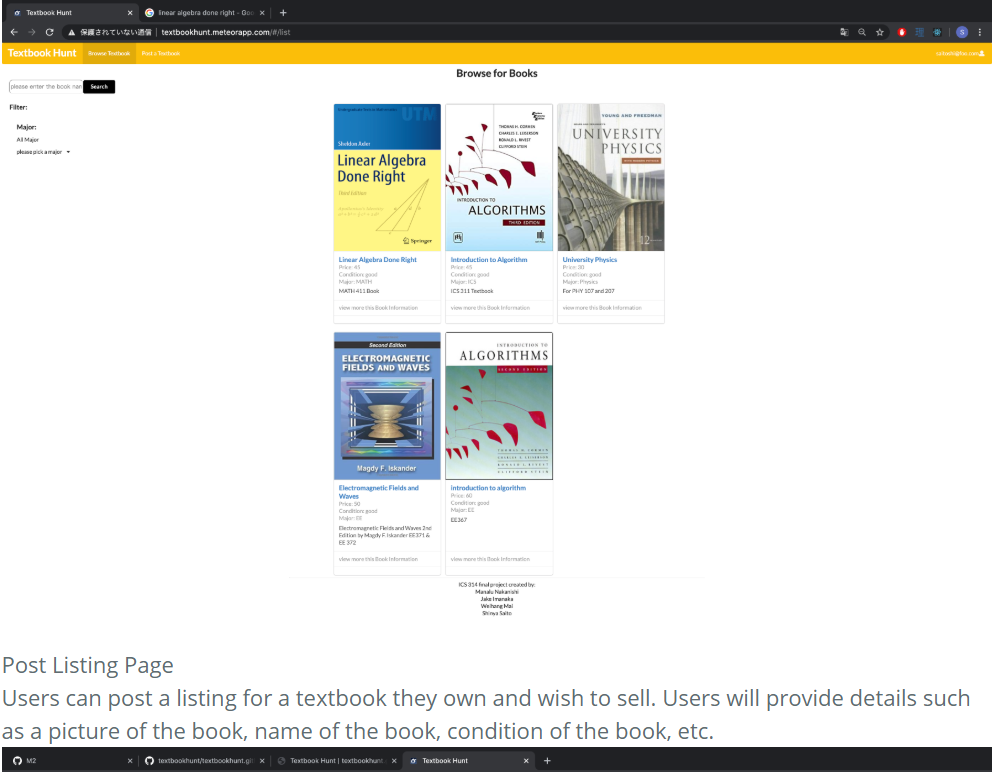

#Description of the project

  
 
  

Textbook Hut project is the final project we did in ICS 314.   Textbook-Hunt is a meteor application providing UH students with a market of used textbooks. When you arrive at the site the first thing you meet is the landing page.

A UH student can log in with their UH account and create a profile in which they can post offers to sell a textbook. As a seller, you can list the different textbooks you are selling by listing the following: name of the textbook, subject department, conditions of the book (Excellent, Good, Okay, etc.), price, and additional comments about the book and the seller.

As a consumer, you can search by textbook name or subject department. Textbook-Hunt will provide a filter page for consumers to filter by condition, department, and/or by price.

A consumer can then arrange with the seller for a payment plan and pick up a textbook.

#My contribution in the project

In this project, we used GitHub Issues to assign each team member different tasks.  We splited our project into three different milestones.  In the milestone one, I made a Navi Bar and footer.  I also made the login mop up page.  In the milestone two, I edited the edit book page to allow user to edit the textbook they are selling.  In the milestone three, I made a major filter on the list textbook page, which allows user to filter the textbook by major.  I also implement a search feature on the list book page, which allows user to search the textbook by name.

#My gains from this project

From this project, I gained experience on building a web application with Meteor and react. I practiced how to get the data from the Mongo and how to add the route for components and pages in the app.js file.  I also learned how to pass the object ID to the URL when clicking a hyperlink or a button to another page, so the new page can get the object ID from the previous page and use the object ID to list the data related to that object from the Mongo DB.  I also learned how to hide a button.  

Besides that, I also learned how to use GitHub to work with other team members to build a web application.  Due to the coronavirus period, I also learned how to use discord to communicate and work with other team members remotely.

Source: <a href="https://github.com/textbookhunt/textbookhunt"><i class="large github icon "></i>source code for this project </a>

You can learn more about this project at the <a href="https://textbookhunt.github.io/"><i class="large github icon"></i>Textbook Hunt</a>
