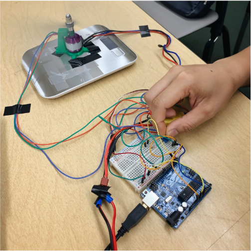
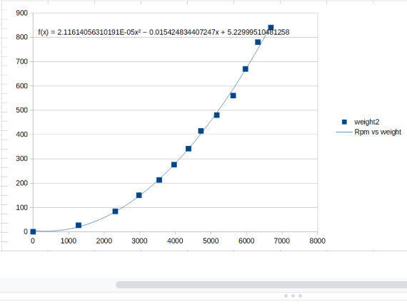

  
  
  

In order to ensure a descending rocket will land softly, a sensor system must be integrated to detect changes in height, velocity, rotations-per-minute (RPM) and thrust. The respective data is essential for proper communication between the microcontroller and the servo motor. The intended goal is to have our sensors output a single height value and to adjust the throttle of the propeller with respect to the velocity as the rocket descends.

For this project, We created an RPM sensor by using a Hall effect sensor and a magnet. The Hall effect sensor uses the Hall effect theory and acts like a switch. We 3D printed a mold, which could hold a magnet against the shaft and also 3D printed a base, which would hold the Hall effect sensor in a permanent position near the shaft. When the motor spins, the magnet passes in front of the Hall effect sensor, changes the magnetic field for that duration that the magnet is in front of the sensor, and sends a signal to the Arduino, thus detecting the rotation. 

By doing this project, I know how to design an embed system with Arduino and how to write code with Arduino.

Source: <a href="https://github.com/Ray4898/Ray4898.github.io/blob/master/RPM.ino"><i class="large github icon "></i>source code for the RPM sensor</a>

