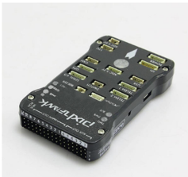

During Fall 2019, I have been working on the VIP project called “Robot Autonomy and Navigation (RAN)” under professor Song.  This is a new project which was just added into the VIP program.  According to the VIP project website, the goal for this project is to “Develop and implement long-term autonomy software and hardware for individual and collaborating mobile robot systems.”

There are three different parts in this project, and I joined the underwater autonomy vehicle competition.  

In this project, I am in charge of the embedded system design. My task for this project was making a program to control the BlueRUV without a joystick in this semester. During that semester, I figured out how to make the PC communicate to and control the Pixhawk directly. The next thing I did was that I figure out how to control the propeller without the joystick.  Although I cannot control individual propeller in the BlueRUV, at least, I could make the propeller on the BlueRUV spin.  I made a tested program to test the control of the propeller.  We didn’t test the RUV under the water, but I believe if the propeller on the BlueRUV spin, the RUV would move.  Then, we just need to set different values in the parameters, we can make the RUV move to different direction as we want.    

By doing this project, I learned the architecture of the BlueRUV. I learned the mavink protocol and how this protocol work. I also learned the Qgroundcontrol.  I also learned the pymavlink. 

Reference 
“Robot Autonomy and Navigation (RAN) - UH VIP,” Google Sites. [Online]. Available: https://sites.google.com/a/hawaii.edu/uh-vip/teams/ran. [Accessed: 21-Dec-2019] 

“Overview,” Overview · GitBook. [Online]. Available: https://www.ardusub.com/. [Accessed: 21-Dec-2019]

MAVLink, “Messages (common),” Messages (common) · MAVLink Developer Guide. [Online]. Available: https://mavlink.io/en/messages/common.html. [Accessed: 21-Dec-2019].

Here is some code that illustrates how I make the propeller spin without joystick using pymavlink:

```js
from pymavlink import mavutil
import time
# Create the connection
# Need to provide the serial port and baudrate
master = mavutil.mavlink_connection(
            '/dev/ttyACM0',
            baud=115200)
master.mav.command_long_send(
    master.target_system,
    master.target_component,
    mavutil.mavlink.MAV_CMD_COMPONENT_ARM_DISARM,
    0,
    1, 0, 0, 0, 0, 0, 0)

t = 0;
while (t<5):

master.mav.manual_control_send(1,500,0,0,0,0)
time.sleep(1)
t= t+1
#master.reboot_autopilot()
```
 
You can learn more at the (UH AUV website) <a href="https://sites.google.com/a/hawaii.edu/uh-vip/teams/ran"><i class="large github icon"></i>AUV</a>
