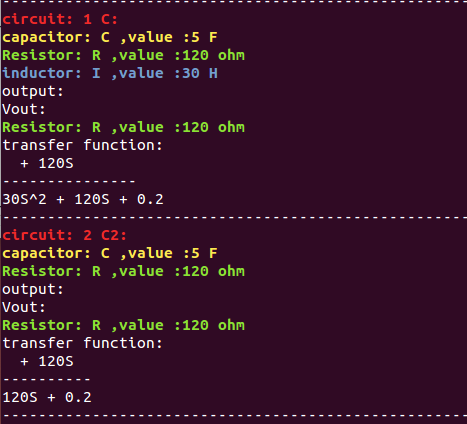

  
 
  

This is the final project I built for EE 205, and this test-based program would generate a transfer function for a filter. This program would first ask the users to enter the elements of a RLC series circuit and to set the value of each element. Then users can decide where the output is. After that, they also can add more RLC circuit from the output of the first circuit to make a cascaded complicated filter. After users finishing making the filter, the program would calculate the transfer function and display it to the users. The main users for this program would be filter designers or engineers. This program would save the filter designers a lot of time designing and making filter.  

This program would display a menu for the users, and it would have four options: capacitor, inductor, resistor and finish. Users can select capacitor, inductor and resistor to add element to the circuit and set the name and value for each element. When users select finish, the program would ask the users if they need to add more filter. If the users enter yes, it would go back to the menu. If the users enter No, it would display a simplified transfer function. If time allows, I may make this program able to save and load filter for the users. I also try to do a research about how to draw the circuit, so I may make the program to draw the final circuit for the users if I find a solution.

In this project, I made and implement the transfer function class, simplification function, and main function for this program.

By doing this program, I got more familiar with programing with C++. Since I used a lot of pointer and vector in this project, I understand more about the pointer and vector. By doing this project, I also understand more about the filter design.

You will need a Linux machine to run the a.out file to run the program. 

Source: <a href="https://github.com/Ray4898/Ray4898.github.io/tree/master/filter"><i class="large github icon "></i>source code and the a.out file </a>

